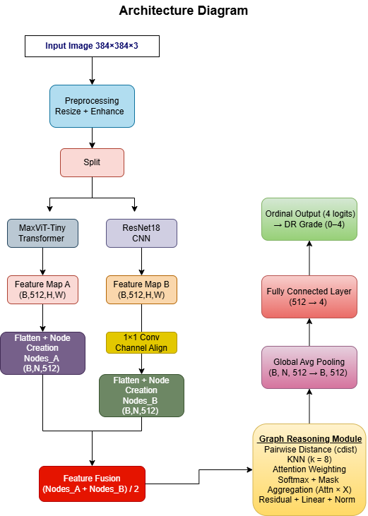
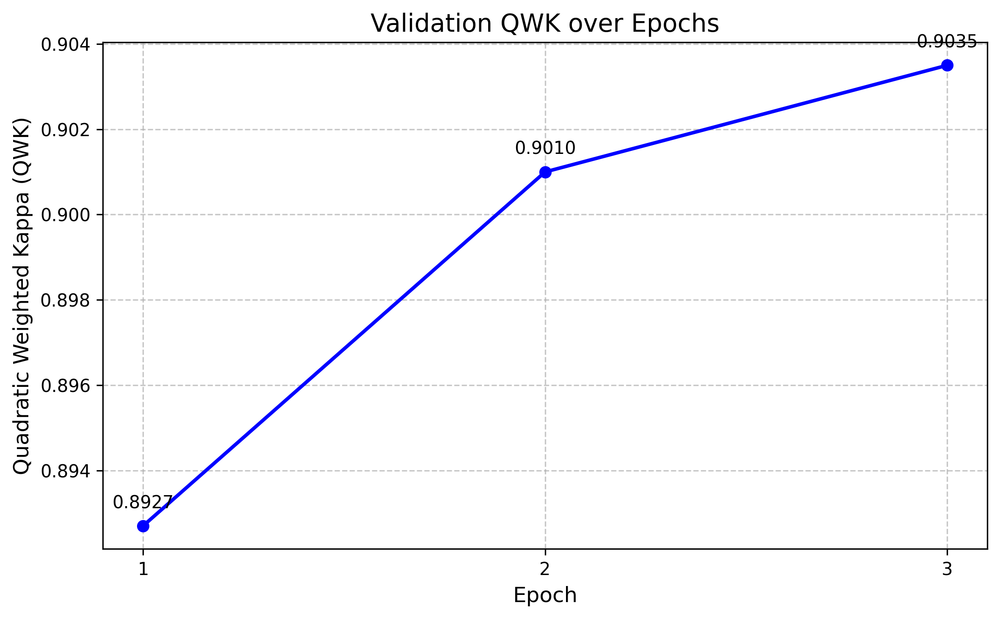

# Graph-Reasoning-Hybrid-Fusion-for-Retinal-Disease-Diagnosis

**Robust 5-Class Retinal Disease Grading on Unified 143k-Image Clinical Dataset**

### **Project Overview**

G-Trans-DSAF is an advanced deep learning pipeline designed for high-precision grading of Diabetic Retinopathy (DR). The core innovation lies in its tri-hybrid architecture, which integrates spatial feature extraction (CNN), global contextual modeling (Transformer), and relational reasoning (Graph Neural Networks) to surpass the performance of standard monolithic models.

The model is trained on a massive, unified dataset of 143,669 clinical images aggregated from EyePACS, APTOS, and Messidor, representing one of the most comprehensive evaluations of DR diagnostic reliability.

### **Architectural Innovation**

The system utilizes a Dual-Stream Adaptive Fusion (DSAF) strategy to resolve the "local-global" trade-off in medical imaging:

**Global Stream (MaxViT):** A Multi-axis Vision Transformer (maxvit_tiny_tf_384) captures long-range dependencies and global structural patterns across the fundus.

**Local Stream (ResNet-18):** A Residual Network backbone focused on high-resolution local feature extraction (e.g., microaneurysms, hemorrhages).

**Graph Reasoning Module (GNN):** Instead of standard global average pooling, we represent fused features as nodes in a graph. A $k$-Nearest Neighbors ($k$-NN) Graph Attention module models the spatial and relational relationships between distant retinal lesions.

**Orthogonal Constraint:** An Orthogonal Loss is applied between the CNN and Transformer streams to minimize feature redundancy, forcing the model to learn complementary representations.

<p align="center">
  
</p>

### **Technical Features**

**Ordinal Regression:** Unlike standard classification, the model uses an ordinal target encoding to preserve the natural progression of DR (Grade 0 $\rightarrow$ 4).

**Ben Graham's Preprocessing:** Images are normalized using Gaussian-weighted subtraction to enhance retinal vasculature and lesion contrast.

**EMA Modeling:** Exponential Moving Average of weights is used to ensure high generalization and training stability.

**Optimization:** AdamW optimizer with Cosine Annealing learning rate scheduling.

### **Dataset Specifications**

The model is validated on a Unified DR Dataset (v2):

**Total Images:** 143,669 (Augmented & Resized to 600x600/384x384).

**Sources:** EyePACS, APTOS, and Messidor.

**Split:** 80% Train | 10% Validation | 10% Test.

**Task:** 5-Class Categorical Grading (No DR, Mild, Moderate, Severe, Proliferative).

### **Performance & Results**

The model's performance was evaluated using the Quadratic Weighted Kappa (QWK), the clinical gold standard for assessing agreement between medical experts.

The results demonstrate expert-level diagnostic reliability, with the final model achieving a QWK of 0.9035. This is particularly significant as it surpasses the typical inter-rater agreement range for human ophthalmologists on the EyePACS and APTOS datasets.


## Performance & Results

The model's performance was evaluated using the **Quadratic Weighted Kappa (QWK)**, the clinical gold standard for assessing agreement between medical experts. 

The results demonstrate **expert-level diagnostic reliability**, with the final model achieving a QWK of **0.9035**.

### **Training Progress**

| Epoch | Validation QWK | 
| :---: | :--- | 
| 1 | 0.8927 | 
| 2 | 0.9010 | 
| **3** | **0.9035** | 

---
<p align="center">
  
</p>

### **Technical Significance**
* **Surpassing Human-Level Consensus:** Achieving a **0.90+ QWK** indicates that the G-Trans-DSAF architecture provides higher consistency in grading than standard multi-expert panels.
* **Robustness to Multi-Source Noise:** Maintaining high performance on a **unified 143,669-image dataset** (EyePACS, APTOS, Messidor) proves the model's ability to generalize across different camera sensors, lighting conditions, and clinical protocols.
* **Efficient Convergence:** The integration of the **Graph Reasoning Module** allowed the model to reach expert-level accuracy in just 3 epochs, demonstrating superior feature representation compared to standard CNN or Transformer backbones.


## System Architecture

```mermaid
flowchart TD
    %% Node Class Definitions
    classDef dataNode fill:#f8f9fa,stroke:#dee2e6,stroke-width:2px,color:#212529,rx:4px,ry:4px
    classDef prepNode fill:#e3f2fd,stroke:#90caf9,stroke-width:2px,color:#0d47a1,rx:4px,ry:4px
    classDef transNode fill:#e8eaf6,stroke:#7986cb,stroke-width:2px,color:#283593,rx:4px,ry:4px
    classDef cnnNode fill:#e8f5e9,stroke:#81c784,stroke-width:2px,color:#2e7d32,rx:4px,ry:4px
    classDef graphNode fill:#fff8e1,stroke:#ffd54f,stroke-width:2px,color:#f57f17,rx:4px,ry:4px
    classDef fusionNode fill:#ffebee,stroke:#e57373,stroke-width:2px,color:#c62828,rx:4px,ry:4px
    
    %% Global Edge styling
    linkStyle default stroke:#78909c,stroke-width:2px

    %% Input
    Input[/"Input Image<br/>(384 × 384 × 3)"/]:::dataNode

    %% Preprocessing
    Preprocess("Preprocessing<br/>Resize (384) + Gaussian Blur Enhance<br/>Albumentations Augmentations"):::prepNode
    Input ==> Preprocess

    %% Dual Stream Subgraph
    subgraph DualStream ["Dual-Stream Feature Extraction"]
        direction TB
        Split{"Split"}
        
        %% MaxViT Branch
        MaxViT("MaxViT-Tiny Transformer<br/>(timm: maxvit_tiny_tf_384)"):::transNode
        FeatA[/"Feature Map A<br/>(B, 512, H, W)"/]:::dataNode
        NodesA("Flatten + Node Creation<br/>Nodes_A (B, N, 512)"):::transNode
        
        %% ResNet Branch
        ResNet("ResNet18 CNN<br/>(timm: resnet18)"):::cnnNode
        FeatB[/"Feature Map B<br/>(B, 512, H, W)"/]:::dataNode
        Align("1×1 Conv<br/>Channel Align (→ 512)"):::cnnNode
        NodesB("Flatten + Node Creation<br/>Nodes_B (B, N, 512)"):::cnnNode

        Split ==> MaxViT
        Split ==> ResNet

        MaxViT ==> FeatA ==> NodesA
        ResNet ==> FeatB ==> Align ==> NodesB
    end

    Preprocess ==> Split

    %% Fusion
    Fusion{"Feature Fusion<br/>(Nodes_A + Nodes_B) / 2"}:::fusionNode
    NodesA ==> Fusion
    NodesB ==> Fusion

    %% Graph Reasoning Subgraph
    subgraph GraphModule ["Graph Reasoning Module"]
        direction TB
        GraphOps{{"Graph Reasoning Module (k=8)<br/>• Pairwise Distance (cdist)<br/>• KNN Search<br/>• Attention Weighting: exp(-dist / sqrt(C))<br/>• Softmax + Mask<br/>• Aggregation (Attn × X)<br/>• Residual + Linear + LayerNorm"}}:::graphNode
    end

    Fusion ==> GraphOps

    %% Output Head
    GAP("Global Avg Pooling<br/>(B, N, 512 → B, 512)"):::transNode
    FC("Fully Connected Layer<br/>Linear (512 → 4)"):::fusionNode
    Output[/"Ordinal Output (4 logits)<br/>→ DR Grade (0–4)"/]:::dataNode

    GraphOps ==> GAP ==> FC ==> Output

    %% Loss Calculation
    Loss{{"G_DSAFLoss<br/>BCEWithLogitsLoss + (0.1 × Orthogonal Loss)"}}:::fusionNode
    Output -.->|"Logits"| Loss
    NodesA -.->|"v_a (Pooled)"| Loss
    NodesB -.->|"v_b (Pooled)"| Loss
